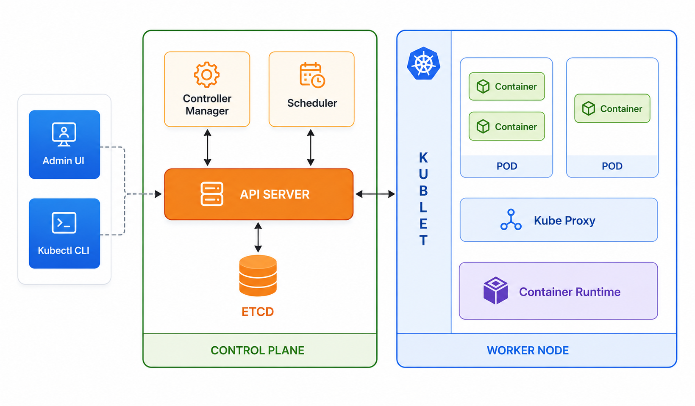

# Kubernetes for Spark Developers

> As a Spark developer deploying applications on Kubernetes, you don't need to learn Kubernetes at the depth of a Kubernetes administrator or DevOps engineer. This guide focuses on the essentials needed to deploy, run, and troubleshoot Spark jobs effectively.

---
## Docker Commands
- create Dockerfile
```bash
FROM node:22-alpine
WORKDIR /app
COPY . .
RUN npm install
CMD ["node", "src/index.js"]
EXPOSE 3000
```
- Build an image
```bash
# -t tag/name the image
# . current directory contains Dockerfile
docker build -t kube_demo .
```
- Add tag to the image
```bash
docker tag kube_demo:latest anishse/kube_demo:latest
```
- Push tag to docker hub
```bash
docker push anishse/kube_demo:latest
```
- Run a container
```bash
# -d → run in background
# -p → port mapping (host_port:container_port)
# -e → environment variable
docker run -d \
  --name kube_demo \
  -p 8080:8080 \
  -e ENV=dev \
  anishse/kube_demo:latest
```
- Check Running Containers
```bash
# running container
docker ps
# All containers
docker ps -a
```
- Enter Container
```bash
docker exec -it kube_demo sh
docker exec -it kube_demo bash
```
- Debugging Containers
```bash
docker logs kube_demo
docker logs -f kube_demo
# see the docker config
docker inspect kube_demo
```
- Image Management
```bash
# list the images
docker images
docker image rm image_id
docker rmi image_id
# useful to forcefully delete
docker rmi -f image_id
```
- Container cleanup
```bash
docker stop kube_demo
docker rm kube_demo
```
## challenges of using standalone containers.
Standalone containers are simple to use but have limitations such as lack of automatic scaling, self-healing, load balancing, centralized monitoring, high availability, and multi-node management. As the number of containers grows, deployment and operations become difficult, which is why container orchestration platforms like Kubernetes are commonly used in production environments.

> Docker provides containerization, while Kubernetes provides orchestration and management of containers at scale. Docker creates containers; Kubernetes manages them.

## Use Kubernetes When:
1. ✅ Multiple services
2. ✅ Multiple servers/nodes
3. ✅ High availability needed
4. ✅ Frequent deployments
5. ✅ Need scaling and self-healing
6. ✅ Spark workloads running in production

## 1. Kubernetes Fundamentals

### Core Concepts
- **Cluster**: Your Kubernetes infrastructure (Control Plane + Worker Nodes)
- **Control Plane**: Manages the cluster (API Server, etcd, Scheduler, Controller Manager)
- **Worker Nodes**: Run your applications
- **Pods**: Smallest deployable unit (usually one container per pod)
- **Containers**: Containerized applications (Docker images)
- **Namespaces**: Virtual clusters for resource organization and isolation
- **Labels & Selectors**: Metadata for organizing and selecting resources

#### Cluster: Kubernetes infrastructure
A Kubernetes cluster consists of a Control Plane that manages the cluster and Worker Nodes that run application workloads.
> For Spark on Kubernetes, the Control Plane schedules Driver and Executor Pods onto Worker Nodes, while the Worker Nodes provide the CPU and memory resources needed to execute the Spark application.



1. Kublet cli   
kubectl is the command-line interface (CLI) for Kubernetes. It allows you to interact with the Kubernetes cluster.

2. Api Server   
The Kubernetes API Server is the entry point to the Kubernetes cluster. All requests from users, tools such as kubectl, and applications such as Spark are sent to the API Server. It validates and processes those requests and coordinates with the rest of the cluster to perform actions like creating Pods, retrieving logs, or scheduling workloads.

3. Controller manager   
The Kubernetes Controller Manager is responsible for monitoring the cluster and ensuring that the actual state matches the desired state defined by users. If pods fail, nodes become unavailable, or replica counts differ from the desired configuration, the Controller Manager takes corrective actions to bring the cluster back to the desired state.

4. Schedular  
The Kubernetes Scheduler is responsible for assigning Pods to Worker Nodes. It evaluates available nodes based on resource requirements, constraints, and scheduling policies, then selects the most suitable node where the Pod should run.

5. etcd  
etcd is a distributed key-value store used by Kubernetes as its backing database. It stores the cluster's configuration, state, and metadata. The API Server interacts with etcd to read and update information about resources such as Pods, Deployments, Services, and Nodes.

6. Kubelet  
Kubelet is an agent that runs on every Kubernetes Worker Node. It receives Pod assignments from the control plane, communicates with the container runtime to start and stop containers, monitors Pod health, and reports node and Pod status back to the API Server.

7. Kube-Proxy  
kube-proxy is a networking component that runs on every Kubernetes Worker Node. It implements Kubernetes Service networking by routing traffic from Services to the appropriate Pods and providing basic load balancing across Pod replicas.

8. Container runtime  
A Container Runtime is the software responsible for pulling container images and running containers on Kubernetes Worker Nodes. Kubelet communicates with the Container Runtime to create, start, stop, and monitor containers. Common runtimes include docker(legacy), containerd(EKS, AKS, GKE) and CRI-O (Openshift).

### Learning Goal
Understand where your Spark driver and executor pods run, and how the cluster manages them.

---

## 2. Kubernetes Objects Used by Spark

### Essential Resources
| Resource | Purpose in Spark |
|----------|-----------------|
| **Pod** | Runs a single driver or executor container |
| **Deployment** | Manages replica sets of pods (rarely used directly with Spark) |
| **Service** | Exposes driver pod to external access (e.g., Spark UI) |
| **ConfigMap** | Stores application configuration files |
| **Secret** | Stores sensitive data (DB credentials, API keys) |
| **PV / PVC** | Persistent storage for data/checkpoints |

### Common Usage Examples
```yaml
# Database credentials stored as Secret
apiVersion: v1
kind: Secret
metadata:
  name: db-credentials
type: Opaque
data:
  username: <base64-encoded>
  password: <base64-encoded>

# Application config stored as ConfigMap
apiVersion: v1
kind: ConfigMap
metadata:
  name: spark-config
data:
  application.conf: |
    spark.default.parallelism=200
```

### Learning Goal
Know how Spark applications interact with these resources and how to mount them into your driver/executor pods.

---

## 3. Essential kubectl Commands

### Pod & Namespace Management
```bash
# View resources
kubectl get pods                          # List all pods in default namespace
kubectl get pods -n <namespace>           # List pods in specific namespace
kubectl get namespaces                    # List all namespaces

# Inspect resources
kubectl describe pod <pod-name>           # Detailed pod information
kubectl logs <pod-name>                   # View pod logs
kubectl logs <pod-name> -f                # Stream logs in real-time
kubectl logs <pod-name> -p                # View logs from previous container

# Debug & troubleshoot
kubectl exec -it <pod-name> -- bash       # Access pod shell
kubectl exec -it <pod-name> -- /bin/sh    # Access pod shell (Alpine/minimal images)
kubectl get events -n <namespace>         # View cluster events

# Cleanup
kubectl delete pod <pod-name>             # Delete a pod
kubectl delete pods --all -n <namespace>  # Delete all pods in namespace
```

### Learning Goal
Debug failed Spark jobs independently by inspecting pod logs, events, and resource usage.

---

## 4. Spark on Kubernetes Architecture

### Deployment Model
1. **Driver Pod**: Submits the Spark application and coordinates executors
2. **Executor Pods**: Execute tasks in parallel
3. **Dynamic Allocation**: Executor pods scale up/down based on workload

### Configuration Example
```bash
spark-submit \
  --master k8s://https://<k8s-apiserver>:6443 \
  --deploy-mode cluster \
  --name my-spark-job \
  --conf spark.executor.instances=5 \
  --conf spark.executor.memory=4g \
  --conf spark.executor.cores=2 \
  --conf spark.kubernetes.container.image=myrepo/spark:latest \
  --conf spark.kubernetes.namespace=spark-jobs \
  s3://my-bucket/my-app.jar
```

### Key Configuration Options
| Option | Purpose |
|--------|---------|
| `spark.executor.instances` | Number of executor pods |
| `spark.executor.memory` | Memory per executor (e.g., 4g) |
| `spark.executor.cores` | CPU cores per executor |
| `spark.kubernetes.container.image` | Docker image with Spark and your app |
| `spark.kubernetes.namespace` | Kubernetes namespace for pods |
| `spark.dynamicAllocation.enabled` | Enable/disable autoscaling executors |

### Learning Goal
Tune Spark applications for optimal resource usage and job completion.

---

## 5. Troubleshooting Common Issues

### Pod Status Issues

| Status | Cause | Solution |
|--------|-------|----------|
| **Pending** | Insufficient resources or unbound PVC | Check node capacity; verify PVC availability |
| **CrashLoopBackOff** | Application error or missing dependencies | Check logs: `kubectl logs <pod>` |
| **ImagePullBackOff** | Invalid/inaccessible Docker image | Verify image name, tag, and registry access |
| **OOMKilled** | Pod exceeded memory limit | Increase memory: `--conf spark.executor.memory=8g` |
| **Unknown/Evicted** | Node ran out of resources | Scale up cluster or reduce executor count |

### Debugging Workflow
```bash
# 1. Check pod status and events
kubectl describe pod <pod-name>

# 2. View logs (driver or executor)
kubectl logs <pod-name>

# 3. Check resource usage
kubectl top pod <pod-name>

# 4. Access pod shell if running
kubectl exec -it <pod-name> -- bash
```

### Learning Goal
Independently diagnose and fix common deployment and execution issues.

---

## 6. Resource Management

### CPU & Memory Requests/Limits
Requests ensure pod placement; limits prevent over-consumption.

```yaml
resources:
  requests:
    memory: "4Gi"
    cpu: "2"
  limits:
    memory: "8Gi"
    cpu: "4"
```

### Best Practices
- **Requests**: Set to expected resource usage
- **Limits**: Set 1.5x–2x higher than requests to handle spikes
- **Driver Pod**: Typically smaller (2–4 CPU, 2–4 GB memory)
- **Executor Pods**: Based on your workload (4–8 CPU, 4–16 GB memory common)

### Spark Configuration for Resources
```bash
--conf spark.kubernetes.driver.request.cores=2
--conf spark.kubernetes.driver.limit.cores=4
--conf spark.kubernetes.driver.memoryOverhead=512m
--conf spark.kubernetes.executor.request.cores=4
--conf spark.kubernetes.executor.limit.cores=8
--conf spark.kubernetes.executor.memoryOverhead=1g
```

### Learning Goal
Avoid executor failures and optimize cluster utilization by properly sizing resources.

---

## 7. Helm for Spark (Optional but Recommended)

### Core Concepts
- **Chart**: Pre-packaged Kubernetes manifests (like a template)
- **Release**: Deployed instance of a chart
- **values.yaml**: Configuration file to customize chart deployment
- **Helm Commands**: `install`, `upgrade`, `rollback`, `uninstall`

### Example: Installing Spark on Kubernetes with Helm
```bash
# Add Spark Helm repository
helm repo add spark-operator https://kubeflow.github.io/spark-operator

# Install Spark Operator
helm install spark-operator spark-operator/spark-operator \
  --namespace spark-operator \
  --create-namespace

# Deploy a Spark application
helm install my-spark-job ./spark-chart \
  --values custom-values.yaml \
  --namespace spark-jobs
```

### Learning Goal
Use Helm to streamline Spark application deployments and manage multiple releases.

---

## Resources & Next Steps

- [Spark on Kubernetes Documentation](https://spark.apache.org/docs/latest/running-on-kubernetes.html)
- [Kubernetes Documentation](https://kubernetes.io/docs/)
- [Helm Documentation](https://helm.sh/docs/)